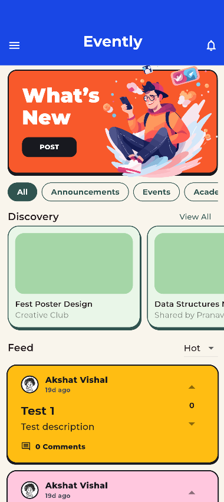
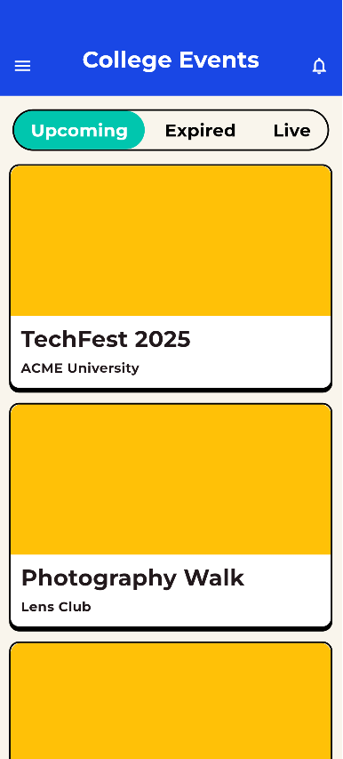
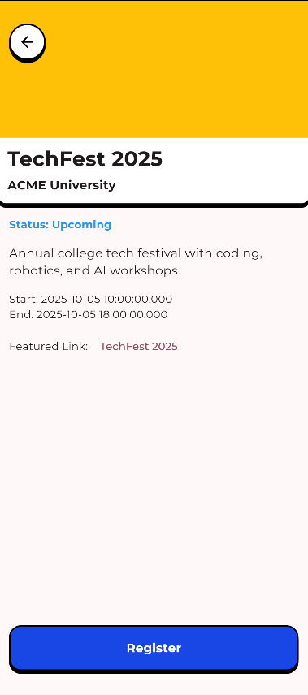

# Evently 🎉 – College Community App

Evently is a **community-driven app for college students**, designed to help students stay connected, share updates, and discover campus events. It fosters engagement and collaboration by providing a platform to create posts, follow events, and interact with peers.  

---

## 📝 Features

- **Campus Feed:** View posts, announcements, and updates from students and admins.  
- **Event Discovery:** Browse upcoming college events, workshops, and meetups.  
- **Create Posts:** Share text, images, and tags with the campus community.  
- **Tagging System:** Add tags to posts for easy categorization and search.  
- **Notifications:** Get notified about new posts, events, or relevant updates.  
- **Admin Panel:** Manage events, moderate posts, and engage with students.  
- **User Authentication:** Secure login system for students.  

---

## 💻 Tech Stack

- **Frontend:** Flutter  
- **Backend:** Firebase (Authentication, Firestore, Storage)  
- **State Management:** Provider / GetX  
- **Notifications:** Firebase Cloud Messaging  

---

## 📸 Screenshots

 

